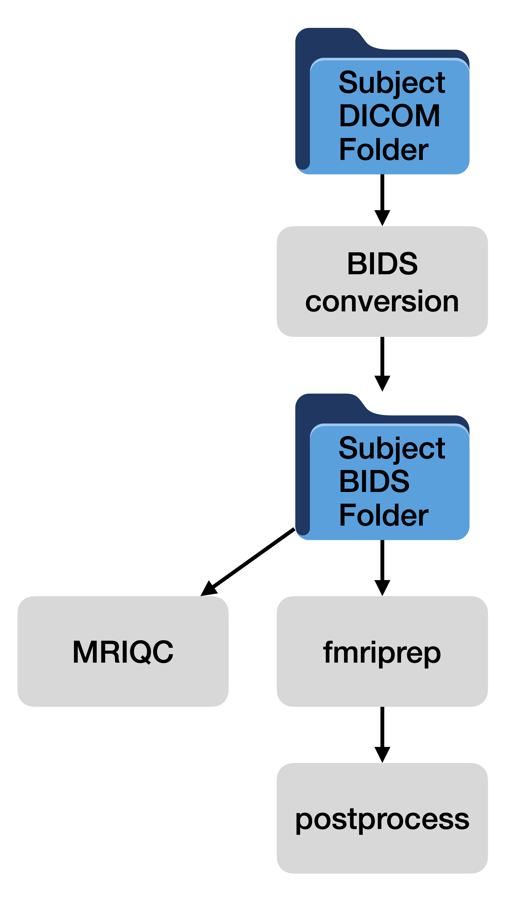

---
title: "BrainGnomes: Study Setup and Execution Tutorial"
author: "Michael Hallquist"
output: rmarkdown::html_vignette
vignette: >
  %\VignetteIndexEntry{BrainGnomes Tutorial}
  %\VignetteEngine{knitr::rmarkdown}
  %\VignetteEncoding{UTF-8}
---

# Introduction

BrainGnomes is an R package designed to streamline the preprocessing and analysis of fMRI data on high-performance computing (HPC) clusters. It serves as a wrapper around common fMRI processing tools such as HeuDiConv (for DICOM-to-BIDS conversion), BIDS Validator, MRIQC (quality control), fMRIPrep (preprocessing pipeline), and ICA-AROMA (automatic removal of motion artifacts), orchestrating their execution in a coherent pipeline. BrainGnomes uses containerized software (Singularity images) to ensure reproducible environments for these tools, and it manages job submission to HPC schedulers (SLURM or TORQUE). In this tutorial, we will walk through the full workflow of setting up and running an fMRI preprocessing study using BrainGnomes. We will cover the three key functions:

- setup_project(): Initialize a new study configuration (either from scratch or from an example YAML)
- edit_project_config(): Interactively review and modify the study configuration by sections
- run_project(): Execute the preprocessing pipeline steps on your dataset, utilizing the HPC environment

Along the way, we assume you have the required Singularity container images for each tool and a working HPC environment. We’ll provide example R code snippets, explain expected inputs/outputs, and offer troubleshooting tips for common issues. By the end of this vignette, a new user should understand how to configure a study and launch the BrainGnomes pipeline from start to finish.

## Basic process flow of BrainGnomes

BrainGnomes identifies data for all subjects (and sessions) in your DICOM and BIDS folders, then determines which subjects need to be processed. It processes data by looping over subjects, submitting jobs for each subject and processing step to the HPC scheduler. This ensures that each subject is processed fully (unless a crash occurs).

{#id .class width=70%}

# Prerequisites and Setup

Before using `BrainGnomes`, ensure the following prerequisites are met:

1. Installation: Install the BrainGnomes R package (for now, you must install from GitHub). Then load it in your R session:
```{r, eval=FALSE}
# Install (if needed) and load BrainGnomes
# devtools::install_github("UNCDEPENdLab/BrainGnomes")
library(BrainGnomes)
```

2. HPC Access: Access to an HPC cluster with a job scheduler supported by BrainGnomes (currently SLURM or TORQUE). You should know which scheduler your cluster uses.
3. Singularity: Singularity must be available on the HPC system
4. You must have downloaded or built the required container image files for:
  - fMRIPrep (e.g., a .sif image of fMRIPrep)
  - HeuDiConv (container for DICOM to BIDS conversion)
  - MRIQC (container for MRI quality metrics)
  - ICA-AROMA (if you plan to use ICA-AROMA for denoising)
  - BIDS Validator (either a container or an installed binary for the BIDS validation tool)
Make note of the filesystem paths to each of these container files or executables, as the configuration will require them.
5. Data and Files:
  - DICOM files for your study, organized in subject (and optionally session) folders.
  - A heuristic file for HeuDiConv (a Python script defining how to translate DICOM filenames into BIDS format). You or your lab should have this .py file prepared for your study's naming conventions.
  - A FreeSurfer license file (e.g., license.txt or FreeSurferLicense.txt). fMRIPrep requires a valid FreeSurfer license to run. You can obtain one for free from the FreeSurfer website. Save the license file path for the configuration.
  - Optionally, a TemplateFlow directory if you want to use a non-default location for TemplateFlow data (standard brain templates). If unsure, you can specify an empty or new directory and fMRIPrep will manage downloading templates there.

With these in place, we can proceed to create a study configuration.

###

# Creating a Study Configuration with `setup_project()`

The first step in using `BrainGnomes` is to create a study configuration, which is essentially a structured list containing all the parameters and paths needed for your pipeline. This configuration can be created interactively using the setup_project() function. `Usage: setup_project(input = NULL, fields = NULL)`. In typical use, you will call setup_project() with no arguments to start a new configuration from scratch, and it will interactively prompt you for all required information. The function returns an object with your settings, which you can later save to a YAML file or reuse in future R sessions. Let's run `setup_project()` to initialize a new study config:

```{r, eval = FALSE}
# Start an interactive setup for a new fMRI study
scfg <- setup_project()
```

Next, the function will ask a series of questions in the R console to gather information about your study. Below we outline the typical prompts and how to respond:

- Project Name – A short name for your project (used for labeling and logging). Example: "MyStudy2025".
- Project Directory – The root directory where all project outputs will be stored. You can provide a path (absolute or relative). If the directory does not exist, BrainGnomes will offer to create it for you. For example: "/proj/Longleaf/MyStudy2025" (this will contain subfolders for BIDS data, fMRIPrep outputs, logs, etc.).
- DICOM Directory – The location of your raw DICOM files. This could be a folder containing subfolders per subject (and session). If it doesn't exist, you'll be prompted to create it as well. For example: "/proj/Longleaf/MyStudy2025/data_DICOMs".
- TemplateFlow Directory – Path to your TemplateFlow data (standard templates for fMRIPrep). If you have a central TemplateFlow directory (e.g., ~/templateflow or a shared path), provide it.
- Scratch Directory – A path for temporary scratch space. This is often on a fast storage (like $TMPDIR or a scratch disk) that is not intended for long-term storage. If you're not sure, you can use a sub-directory in your project directory (e.g., "/proj/Longleaf/MyStudy2025/scratch"). Just make sure to keep an eye on the size of this folder and clean it up periodically if this isn't done automatically by your HPC system.
- Enable Text Logging – You will be asked whether to create subject-level log files (log_txt flag) for tracking job submissions and status. It’s highly recommended to answer "yes" (TRUE) to enable logging, as these logs greatly aid in debugging pipeline issues. The logs will be stored in logs/ under your project directory, with separate folder per subject.
- ICA-AROMA Option – Next, you'll be asked “Run AROMA?”, i.e., whether you want to include ICA-AROMA denoising as part of the pipeline. If you answer "yes", the pipeline will plan to run the ICA-AROMA step after fMRIPrep. (Note: As of fMRIPrep v20.2+, ICA-AROMA is no longer integrated in fMRIPrep and must be run separately as a BIDS-App called fmripost-aroma.) If you choose "yes," be prepared to provide the path to an AROMA container in the compute environment section later. If unsure, you can say "no" to skip AROMA for now.

After these global questions, `setup_project()` will proceed into configuring each major part of the pipeline in turn. For each section, you will either be prompted for specific sub-fields or defaults will be applied. Below is an overview of each section and what information is collected:

## Compute environment setup

The compute environment includes the locations of key Singularity containers needed to run various steps in the pipeline. As part of `setup_project()`, you will be asked to provide the following:

- Scheduler: Choose between "slurm" or "torque" depending on your cluster’s job scheduler. This ensures that the correct job submission scripts (SLURM sbatch vs TORQUE qsub) are used.
- Container Paths: Provide the file paths for each container or executable:
  1. fMRIPrep container: e.g. "/path/to/fmriprep-22.0.2.sif".
  2. HeuDiConv container: e.g. "/path/to/heudiconv-0.11.3.sif".
  3. BIDS Validator: If you have a Singularity image or a binary, provide its path (e.g. "/path/to/bids-validator.sif" or "/path/to/node_modules/.bin/bids-validator").
  4. MRIQC container: e.g. "/path/to/mriqc-0.16.1.sif".
  5. AROMA container: if you opted to run AROMA, the path to the ICA-AROMA BIDS app container (e.g. "/path/to/fmripost-aroma.sif"). If you said "no" to AROMA earlier, this might be skipped or you can leave it blank.

BrainGnomes will verify that each file exists; if any path is invalid, it will prompt again or mark the config as incomplete for validation. Make sure the paths are correct and accessible on the compute nodes.

## HPC job settings

Each of the top-level steps in processing is 

## BIDS conversion setup

`BrainGnomes` uses HeuDiConv (https://github.com/nipy/heudiconv) to convert DICOM images into BIDS-compatible files and folders. HeuDiConv requires information on how to identify subjects/sessions in your DICOM folder and how to convert them. As part of the BIDS conversion setup, you will be asked to provide:

1. Subject Regex: A regular expression used to match all subject directories in the root of your DICOM directory. Consider, for example, that your DICOM directory includes the following folders: `logs`, `5300`, and `5420`, where the numbered directories are the subject IDs. In this case, a good regular expression for identifying subjects would be, `[0-9]+` -- matching folders containing numbers. If you want any folder in the root of your DICOM directory to be considered a subject folder, use `.*`.

2. (Optional) Session Regex: if you have multi-session data and these are stored in your DICOM directory as subfolders (i.e., something like sub-100/ses-1, sub-100/ses-2) you may specify a regular expression to match session folders inside each subject's folder. For example, a session regex of `ses-[0-9]+` would match any subfolder starting with `ses-` followed by one or more numbers. If you do not have multisession data in this form, leave this blank.

3. Subject ID Match Regex: Whereas the Subject Regex specifies what folders in the root of your DICOM directory should be considered, the Subject ID Match regular expression specifies how to *extract* the ID from the folder name. Use parentheses to denote which part of the folder name should be preserved as part of the ID. For example, if folders are named something like `sub-<numbers>` and you want to keep the numeric part as the ID, the Subject ID Match Regex would be, `sub-([0-9]+)`. If the ID is stored in different parts of the folder name, you can use more than one set of parenthese, in which case these will be extracted and pasted together with an underscore separating each part. For example, consider a folder `subject-16-visit-3`. You could extract a subject ID of `16_3` using the Regex: `subject-([0-9]+)-visit-([0-9]+)`.

4. Session Match Regex: This follows the same logic as the Subject ID Match Regex, but applies to session folders nested within subject folders. For example, if you have a folder like: `subject-12/ses-1`, you would specify `subject-([0-9]+)` as your subject ID match regex and `ses-([0-9]+)` as your session match regex.

5. Heuristic File: Path to the heudiconv heuristic Python script for your study. For example: `"/proj/Longleaf/MyStudy2025/heuristic.py"`. This script defines the naming scheme for converting DICOMs to BIDS format. Details for preparing such files can be found here: https://heudiconv.readthedocs.io/en/latest/heuristics.html.

6. Overwrite and Clear Cache: Boolean flags (overwrite and clear_cache) that determine if heudiconv should overwrite existing converted data and clear any caching between runs. Usually, you can accept defaults (FALSE) unless you are re-running conversion and want to start fresh.

7. Validate BIDS: A flag whether to run the BIDS Validator automatically after conversion (heudiconv has an option to do this). Even if set to FALSE, note that BrainGnomes includes a separate BIDS Validation step (next section), so this flag is optional. It’s safe to say "no" here and rely on the dedicated validation step.

BIDS Validation – If you have provided a BIDS Validator path, BrainGnomes can run it on your converted data. The main prompt here is for the name of the output file produced by the validator
GitHub
. By default it might be "bids_validator_output.html"
GitHub
, which will contain a report of any BIDS compliance issues. You can accept the default or specify a pattern. (The prompt allows insertion of placeholders like {{sub_id}} for subject and {{ses_id}} for session in the filename if you want separate outputs per subject
GitHub
. Typically, a single summary file is fine.)

## fmripprep setup

In this step, you will specify the following settings for 

Output Spaces: You will choose the standard spaces that fMRIPrep should output the preprocessed data in. Common choices include MNI anatomical spaces (e.g., MNI152NLin6Asym), the subject's T1w native space, fsaverage (for surface data), etc. The setup_project() function will present a menu or prompt for selecting these. You can pick multiple spaces. For example, a typical selection might be MNI152NLin6Asym and T1w (and if analyzing surface data, possibly fsaverage).
FreeSurfer License File: You must provide the path to your FreeSurfer license file so fMRIPrep can run FreeSurfer during preprocessing
GitHub
. BrainGnomes will explicitly ask for this and remind you it’s required. For example: "/proj/Longleaf/MyStudy2025/FreeSurferLicense.txt". Ensure this file is accessible on the system (you can also set the FS_LICENSE environment variable, but providing it in the config is straightforward).
Resource settings: BrainGnomes will assign default HPC resource requests for fMRIPrep (like memory, CPU cores, runtime) – e.g., 48 GB RAM, 12 cores, 24 hours by default
GitHub
 – which are usually suitable for moderate-sized datasets. We will see later how to adjust these if needed using the editing function.
MRIQC Configuration – MRIQC does not typically require special user input aside from the container path already given. The pipeline will include MRIQC if you opt to run it (you will choose during run_project()). There might be a prompt for whether to run group-level MRIQC reports; if so, answer according to your needs (for single-subject reports only, "no" is fine). Resource defaults for MRIQC (RAM/CPU) are set internally.
ICA-AROMA – If you chose to include AROMA, BrainGnomes will have you provide the container path earlier. There aren’t additional settings at this stage (aside from confirming the container path). The actual application of AROMA’s outputs (i.e., whether to regress out the identified noise components) is handled in postprocessing.
Postprocessing – This is the final configuration section, handling any processing steps to apply after fMRIPrep (and AROMA). BrainGnomes is quite flexible here, allowing you to specify a sequence of operations on the cleaned fMRI data. Key prompts include:
Input File Pattern: A regex or suffix for the files you want to postprocess. By default, it targets fMRIPrep’s preprocessed BOLD files ending in _desc-preproc_bold.nii.gz
GitHub
, which is usually what you want. If you have multiple tasks or only want to process some of them, you could modify this pattern (the prompt gives examples
GitHub
). Most users can accept the default (_desc-preproc_bold.nii.gz$).
Keep Intermediates: Whether to retain intermediate files from postprocessing (defaults to "no"/FALSE)
GitHub
. These intermediates might be, for example, files before/after each step in the pipeline. Keeping them can consume a lot of space, so say "no" unless debugging.
Overwrite: If outputs from a previous postprocessing run exist, should they be overwritten? (Defaults to FALSE, meaning the pipeline will skip already-processed data unless forced)
GitHub
.
Repetition Time (TR): The TR (in seconds) of your functional scans
GitHub
. This is important for filtering and other temporal operations. Enter the TR exactly (e.g., 2 for 2.0s TR). If your study has multiple TRs (uncommon), you might have to adjust accordingly.
Apply Brain Mask: Whether to apply a brain mask to the functional data during postprocessing
GitHub
. Masking can exclude non-brain voxels, making some calculations (like intensity normalization) more accurate. If you choose "YES", it will then ask you to provide a brain mask file (e.g., a standard brain mask in MNI space) to use for all subjects
GitHub
. It is recommended to provide a high-quality mask (in the same space as your data) if you plan to mask the data; otherwise, you can say "NO" and BrainGnomes will attempt to use fMRIPrep’s brain masks or compute one if needed
GitHub
.
Spatial Smoothing: You will be prompted to specify spatial smoothing parameters if desired. Typically, the question will be a FWHM in millimeters for a Gaussian kernel (e.g., 6 mm). You can enter a value or 0 for no smoothing.
ICA-AROMA Removal: If you ran AROMA, you’ll be asked if you want to apply the AROMA noise components (non-aggressively remove them from the data). This corresponds to the "nonaggressive" flag
GitHub
. Choosing TRUE means the pipeline will regress out the AROMA-flagged components from the BOLD data (non-aggressive denoising).
Temporal Filtering: You can specify high-pass and/or low-pass filter cutoffs (in Hz) for temporal filtering of the BOLD time series. For example, a common high-pass filter is 0.008 Hz (to remove very slow drifts). If you don't want a filter, you can leave these blank or 0.
Intensity Normalization: Option to normalize intensity (e.g., global median scaling of each volume). You might be asked if you want to scale each run's median intensity to a constant value (this can help standardize units across subjects).
Confound Extraction and Regression: Finally, you will decide if you want to calculate additional confound regressors (e.g., motion parameters, aCompCor, etc. – although fMRIPrep already provides many) and whether to regress out confounds from the data. If you intend to use fMRIPrep outputs as-is for first-level analysis in another software, you might skip this. But BrainGnomes allows you to specify confound regression here as part of postprocessing, which can save a step later. Typically, you might say "yes" to confound regression if you want to output fully denoised time series (you will have to specify which confounds to use – likely via configuration or default to 6 motion parameters + maybe AROMA components if applicable).
During this postprocessing setup, the package will also ask in which order to apply these steps (masking, smoothing, filtering, normalization, confound regression). It will ensure the order is logical (e.g., filtering happens prior to regression if required to avoid frequency mismatches
GitHub
). You can usually accept the suggested default ordering or adjust if you have specific needs. After going through all these prompts, the interactive setup is complete. The result is an R list object scfg containing all the configuration details. You can print or inspect it to verify the contents. A quick way to see a summary of the configuration is:
summary(scfg)
This will print a nicely formatted summary of your bg_project_cfg object
GitHub
, listing each section and field. For example, you should see your project name, paths, and each pipeline step’s settings in the summary output. It’s a good idea at this point to save the configuration to a YAML file for future reuse or reference. BrainGnomes provides a load_project() for reading a YAML config
GitHub
, but not an explicit save function, so you can use the yaml package to write it:
yaml::write_yaml(scfg, "my_project_config.yaml")
This creates a YAML text file with all your settings. The my_project_config.yaml would look something like this (for illustration):
```
project_name: "MyStudy2025"
project_directory: "/proj/Longleaf/MyStudy2025"
dicom_directory: "/proj/Longleaf/MyStudy2025/data_DICOMs"
scratch_directory: "/proj/Longleaf/MyStudy2025/scratch"
templateflow_home: "/proj/Longleaf/MyStudy2025/templateflow"
log_txt: true

compute_environment:
  scheduler: "slurm"
  fmriprep_container: "/proj/Containers/fmriprep-22.0.2.sif"
  heudiconv_container: "/proj/Containers/heudiconv-0.11.3.sif"
  bids_validator: "/proj/Containers/bids-validator.sif"
  mriqc_container: "/proj/Containers/mriqc-0.16.1.sif"
  aroma_container: "/proj/Containers/fmripost-aroma.sif"

heudiconv:
  sub_regex: "^sub-(.*)$"
  sub_id_match: "\\1"
  ses_regex: "^ses-(.*)$"
  ses_id_match: "\\1"
  heuristic_file: "/proj/Longleaf/MyStudy2025/heuristic.py"
  overwrite: false
  clear_cache: false
  validate_bids: false

bids_validation:
  outfile: "bids_validator_output.html"

fmriprep:
  output_spaces: ["MNI152NLin6Asym", "T1w"]
  fs_license_file: "/proj/Longleaf/MyStudy2025/FreeSurferLicense.txt"

mriqc: {}         # (no special fields)
aroma: {}         # (no special fields; run_aroma was true, so aroma step can be run)
postprocess:
  input_regex: "_desc-preproc_bold.nii.gz$"
  keep_intermediates: false
  overwrite: false
  tr: 2.0
  apply_mask: true
  brain_mask: "/proj/Longleaf/MyStudy2025/MNI_template_mask.nii.gz"
  spatial_smooth:
    fwhm_mm: 6
  apply_aroma:
    nonaggressive: true
  temporal_filter:
    high_pass_hz: 0.008
    low_pass_hz: 0.1
  intensity_normalize:
    global_median: true
  confound_calculate: true
  confound_regress: true
  processing_steps: ["apply_mask", "spatial_smooth", "temporal_filter", "confound_regress"]
```  

Note: The above is an example configuration for illustration. Your actual my_project_config.yaml will reflect the answers you provided. You can edit this file manually if needed (just be careful with YAML syntax), or better, use the BrainGnomes editing function described next.
###


----

# TO BE DIGESTED

# Editing the Configuration with edit_project()

It is common to realize that some settings need to be adjusted after the initial setup. Rather than re-running the whole setup_project() interactive sequence, BrainGnomes offers edit_project() for convenient editing of specific fields in your configuration. This function launches an interactive menu-driven editor in the R console, allowing you to navigate the config by sections and choose which values to modify .

Usage: edit_project(scfg) where scfg is your bg_project_cfg object. It returns the modified scfg (after you make edits) .

Let’s say we want to change a few things in our configuration – for example, maybe we got the path to the fMRIPrep container wrong, or we want to increase the allotted memory for fMRIPrep jobs. We can do:

```
# Launch the interactive config editor
scfg <- edit_project(scfg)
```

Once you run this, you’ll see a menu like:

```
Select a configuration area to edit:
1: General
2: Compute Environment
3: HeuDiConv
4: BIDS Validation
5: fMRIPrep
6: MRIQC
7: ICA-AROMA
8: Postprocessing
9: Job settings
10: Quit
```

These menu options correspond to the sections of the config. For example, “General” includes basic fields like project_name and directories , “Compute Environment” includes the scheduler and container paths , etc., and “Job settings” allows editing of resource parameters across pipeline steps.

To use the editor:
	•	Navigate: Enter the number of the section you want to edit. If you choose a section with defined sub-fields (e.g., “Compute Environment” or “HeuDiConv”), the editor will display a list of fields in that section along with their current values, and allow you to select one or multiple to edit. For example, selecting “Compute Environment” might list:
scheduler [ slurm ]
fmriprep_container [ /proj/Containers/fmriprep-22.0.2.sif ]
heudiconv_container [ ... ]
etc., so you can see what’s set . You then choose one or more fields from that list (by number or name, depending on the prompt) to change. The function will re-run the appropriate setup function for those fields, prompting you just for the selected ones .
Example: If you pick Compute Environment and then select fmriprep_container, it will ask you to enter a new path for the fMRIPrep container. After updating, it returns to the main menu.
	•	If a section has no individual fields listed (you’ll see a message like “No individual fields listed for MRIQC, opening full setup…” ), it means that to change anything there, the function will re-run that section’s setup prompts in full. For instance, selecting “MRIQC” might re-run the MRIQC setup (which might just confirm defaults), or “ICA-AROMA” might not have individual fields so it could toggle run_aroma or similar. Typically, you won’t need to edit those often.
	•	The Job settings option is particularly useful to fine-tune HPC resource allocations. If you select “Job settings”, you will then be asked which job to configure (HeuDiConv, BIDS validation, fMRIPrep, MRIQC, AROMA, or Postprocess) . After choosing a pipeline step, you’ll see a list of resource parameters for that step with current values, for example:
memgb [ 48 ]
nhours [ 24 ]
ncores [ 12 ]
cli_options [  ]
sched_args [  ]
You can select one or multiple of these to edit . This allows you to increase or decrease memory, CPU, or time for the jobs if needed. For instance, if fMRIPrep was running out of memory, you might increase memgb to 64 or 96. Or if it finishes quickly, you might reduce nhours to fit within queue limits. After making changes, these new values will be saved in scfg.
	•	Continue editing other sections as needed. When finished, choose “Quit” to exit the editor  . The updated scfg object now contains your modifications.

You can again summary(scfg) to verify changes. If you had saved a YAML file earlier, you may want to write out a new version (or overwrite it) with yaml::write_yaml(scfg, "my_project_config.yaml") so that your changes persist for next time. (Alternatively, you could use load_project("my_project_config.yaml") in a future session to reload and then edit further.)

Tip: You can run edit_project() as many times as needed. It’s a safe, user-friendly way to adjust configuration without manually editing the YAML and risking formatting mistakes. Under the hood, it uses the same setup prompts but targeted to specific fields you select  .

# Running the Pipeline with run_project()

Now that your study configuration scfg is complete and accurate, you are ready to run the preprocessing pipeline. The run_project() function will orchestrate the entire process, from DICOM conversion to postprocessing, by submitting jobs to the cluster for each step and each subject as needed.

Usage: run_project(scfg, steps = NULL, prompt = TRUE, debug = FALSE, force = FALSE) . The key arguments are:
	•	scfg: your configuration list.
	•	steps: an optional character vector of step names to run. By default NULL means run all applicable steps . You can also specify a subset (e.g., run only "fmriprep" and "postprocess" if you already did conversion/QC earlier).
	•	prompt: if TRUE, the function will interactively ask you which steps to run (useful for ad-hoc runs) . If FALSE, it will run the steps given in steps argument without asking.
	•	debug: if TRUE, the pipeline runs in debug mode – it will print the commands and steps it would execute but not actually run them (no jobs executed) . This is useful for testing or verifying before a big run.
	•	force: if TRUE, forces re-execution of steps even if they seem already completed . By default, BrainGnomes will skip steps for a subject if it finds a completion marker from a previous run (to avoid redundant work) . Setting force=TRUE overrides this and reruns everything, which is handy if you made changes and need to redo preprocessing from scratch.

For a first full run, you’ll typically call run_project(scfg, prompt=TRUE) to be guided through step selection:

```
# Run the pipeline, interactively selecting steps to execute
run_project(scfg, prompt = TRUE)
```

When you execute this, run_project() will print a menu or series of yes/no prompts such as:

```
Please select which steps to run:
Run BIDS conversion? (TRUE/FALSE)
Run BIDS validation? (TRUE/FALSE)
Run MRIQC? (TRUE/FALSE)
Run fMRIPrep? (TRUE/FALSE)
Run ICA-AROMA? (TRUE/FALSE)
Run postprocessing? (TRUE/FALSE)
```

You should answer each of these (usually “yes” for the steps you want to perform in this run). For an initial pipeline run on new data, you would answer “yes” to everything (if you have all steps configured) so that the entire pipeline runs . If, for example, you only wanted to test the conversion and validation first, you could run those and say “no” to fMRIPrep, etc., and run others later.

After this, you will also be prompted whether to run in debug mode and whether to force each step regardless of previous runs . For a normal run, answer “no” to debug (so it actually processes data) and “no” to force (unless you have a reason to redo completed steps). You’ll also be asked to choose a log detail level (INFO, DEBUG, or ERROR) for the logs  – “INFO” is a good default for general use (it logs important information without too much verbosity).

Once you’ve made these selections, run_project() begins executing. Here’s what it does under the hood:
	•	It checks that necessary prerequisites are in place for each selected step (for example, if you chose BIDS conversion, it ensures your regex patterns and container paths for HeuDiConv are set; if you chose fMRIPrep, it checks the FS license and fMRIPrep container exist, etc.)  . If anything critical is missing, it will throw an error and stop before submitting jobs (so you can fix the config).
	•	It then scans your DICOM directory for subjects (and sessions) to create a list of subjects to process . Similarly, it looks at your BIDS directory to see which subjects might already have converted data . This helps manage incremental processing.
	•	For each subject, it will submit cluster jobs in the proper order. The BrainGnomes pipeline is clever in handling dependencies: for each subject, BIDS conversion (HeuDiConv) jobs are submitted (one per session if multi-session), then once DICOM conversion is done, BIDS validation, MRIQC, and fMRIPrep jobs are submitted. fMRIPrep typically runs per subject (after all sessions are converted) . If ICA-AROMA is enabled, an AROMA job runs after fMRIPrep for that subject. Postprocessing jobs come last, potentially per session (for session-specific outputs) or per subject, depending on the nature of each step . The pipeline ensures that, for example, fMRIPrep doesn’t start until BIDS conversion is complete for that subject, etc., by using the scheduler’s job dependency features (this is transparent to the user but happens via the submitted scripts).
	•	As jobs are submitted, BrainGnomes logs their submission and keeps track of “.complete” files for each step. A .complete file is a marker file written to the log directory (e.g., logs/sub-001/.bids_conversion_sub-001_complete) once a step finishes for a subject . If you rerun the pipeline without force, these markers tell BrainGnomes to skip already completed steps .
	•	run_project() will return TRUE if the pipeline submission was successful (note: it returns immediately after scheduling the jobs, not after all jobs finish running) . A successful return just means the jobs were launched without errors in setup. The actual processing will happen on the cluster asynchronously. If there was an error in the setup (e.g., missing files or directories), it might return an error or FALSE , in which case you should review the error message, fix the config, and try again.

At this point, your jobs are queued/running on the cluster. You can monitor them using your cluster’s job monitoring commands (e.g., squeue for SLURM or qstat for TORQUE) to see that they are progressing. BrainGnomes handles submitting the appropriate array jobs or individual jobs for each subject’s steps.

# Monitoring Output and Logs

All outputs from the pipeline will be stored in your project directory:
	•	BIDS-converted data will appear under data_bids/ in your project directory (BrainGnomes automatically set scfg$metadata$bids_directory to <project_directory>/data_bids ). You should see sub-<ID> folders there after HeuDiConv runs, containing NIfTI images and JSON sidecars as per BIDS.
	•	fMRIPrep outputs will be in data_fmriprep/ under your project directory (scfg$metadata$fmriprep_directory is set to <project_directory>/data_fmriprep ). This will mirror fMRIPrep’s usual output structure (subfolders per subject with anat/func files, logs, etc.).
	•	MRIQC outputs (if run) will likely be in a data_mriqc/ directory or inside data_bids/ under derivatives; BrainGnomes config typically might set an mriqc_directory (if not, check the MRIQC output path in logs).
	•	Postprocessing outputs will typically produce a new set of files (e.g., filtered, smoothed, denoised BOLD images) stored in a subfolder or appended filename in the BIDS structure. For example, BrainGnomes may output files with suffixes indicating the postprocessing steps (like _smoothed or _AROMA in the filename). The exact location/pattern can be deduced from the processing_steps and the code, but generally they might be placed in the fMRIPrep derivatives folder or a new postproc folder. Check the log messages for details.

The logs directory (<project_directory>/logs) will contain log files that are extremely useful for troubleshooting:
	•	There will be a log file for each subject (since we enabled log_txt). For example, logs/sub-001/sub-001.log (the exact naming might differ). This file contains messages about each step for that subject, including any warnings or errors.
	•	Additionally, the stdout and stderr from each cluster job are typically captured in files named by job and timestamp in the logs subdirectories . For instance, you might see files like bids_conversion_sub-001_jobid-12345.out or .err inside the subject’s log folder, containing the console output of the heudiconv or fmriprep commands. These are critical for debugging if something fails (they contain tool-specific error messages).

# Guidance and Troubleshooting Tips

Even with a well-specified configuration, issues can arise. Here are some common scenarios and tips:
	•	Incomplete or Incorrect Configuration: If run_project() stops immediately with an error, read the message. It often points to missing config fields. For example, if you forgot to set the heuristic_file or a container path, the validation in run_project() will catch it and stop . In that case, use edit_project() or manually fix the YAML to add the missing information, then try again. Remember, you can always reload an edited YAML with scfg <- load_project("my_project_config.yaml")  (which reads and validates it) and then run.
	•	Singularity not found: If the cluster jobs fail immediately and the error logs show something like “singularity: command not found”, it means on the compute nodes Singularity isn’t in the PATH. You might need to load a module or adjust sched_args in the config to load it. For example, if on SLURM you need to load singularity, you could add something in scfg$fmriprep$sched_args like "#SBATCH --container-image=<path>" or use environment setup. This is cluster-specific. BrainGnomes mostly assumes Singularity is available. You can edit the job submission templates if needed (advanced use).
	•	Permission issues: If directories could not be created or written to, make sure you have proper permissions. BrainGnomes warns if you lack read permission on the project directory . Ensure your user can read/write in all specified directories.
	•	Container path issues: If a container path is wrong, the job will likely fail with an error like “file not found”. Double-check the compute_environment paths in your config. A quick way: file.exists(scfg$compute_environment$fmriprep_container) in R should return TRUE. If not, fix the path. Common mistakes are typos in filenames or using a path not visible to compute nodes (use a shared filesystem path).
	•	HeuDiConv errors: If BIDS conversion fails, inspect the .err log for the heudiconv job. Often errors are due to the heuristic file (e.g., a bug in the script), or not finding any DICOMs (maybe the regex didn’t match your folder names). You can test your regex outside BrainGnomes on a list of DICOM folder names to ensure it captures the IDs properly. If heudiconv produced partial output, you may need to set overwrite=TRUE and rerun conversion (or manually delete the incomplete outputs) to retry. Use force=TRUE in run_project() on the next run if needed to force re-conversion .
	•	fMRIPrep issues: A common issue is forgetting the FreeSurfer license. fMRIPrep will abort if the license is not found or invalid. Ensure the license file path in config is correct. Also, if fMRIPrep jobs get killed by the scheduler (check if the error log ends abruptly or says out-of-memory), consider increasing memgb or splitting into more cores. Use edit_project() -> Job settings -> fMRIPrep to adjust memgb and ncores. For example, if your cluster nodes have 64GB, you might allocate memgb=60 and ncores=16 (assuming fMRIPrep can use those cores efficiently). Also check that your scheduler choice was correct: if you set the wrong one, job submissions might fail.
	•	ICA-AROMA: If you enabled AROMA but didn’t provide a container, the run will stop with an error that AROMA container is missing . If you don’t intend to run AROMA after all, you can set scfg$run_aroma <- FALSE (and maybe remove aroma_container path) and skip that step. If you do want AROMA, obtain the container and update the path, then resume.
	•	Postprocessing pitfalls: Postprocessing is optional, but if configured, ensure that the steps make sense. If you chose to apply a mask but didn’t provide one, the pipeline will try to use fMRIPrep’s masks or generate one. If you find the postprocessing failing, you can simplify it (e.g., try turning off some steps) to isolate the issue. Each step writes its own .complete file; check which step didn’t produce one to see where it halted. The subject log (e.g., sub-001.log) will also indicate any errors. Adjust the config accordingly (for example, if a smoothing step failed due to missing mask, try providing a mask or disable that step).
	•	Re-running vs. forcing: BrainGnomes uses the presence of output and log markers to decide whether to skip steps. If you made a minor change and want to re-run a step (say you fixed the heuristic and want to reconvert DICOMs), you have two options:
(1) Manually delete the .complete files and any output from that step for the affected subjects, then run again normally; or
(2) Run with force=TRUE to ignore the markers and do all steps anew  . The force option is blunt – it will re-run everything you include in this run, even if outputs exist, so use it when you really want a fresh start (it won’t delete old outputs, but will overwrite or duplicate as configured). If you only want to re-run one part (e.g., just fMRIPrep), you can specify steps=c("fmriprep") and force=TRUE to only force that part.
	•	Running in Debug Mode: If you want to do a “dry run” to see the sequence of operations without processing data, run run_project(scfg, prompt=TRUE, debug=TRUE). In debug mode, BrainGnomes will go through the motions but not actually execute the heavy processing – it will log the commands that would have been run for each job . This can be useful to verify that your config yields the expected calls (for example, you can see the exact singularity exec ... fmriprep ... command and ensure paths are correct). Remember to set debug=FALSE when you are ready for the real run.

Finally, once the pipeline completes for all subjects, you should have fully preprocessed fMRI data ready for analysis. BrainGnomes aims to automate the heavy lifting, but understanding the pieces helps in case you need to customize or troubleshoot. If issues persist, consult the BrainGnomes GitHub issues page or documentation for assistance  .

We hope this tutorial has given you a comprehensive overview of using BrainGnomes. By following the steps to set up the study, edit configurations as needed, and run the pipeline, new users should be able to harness HPC resources and Singularity containers to preprocess fMRI data efficiently and reproducibly. Good luck with your neuroimaging study!


----
 # SOME OTHER AUTO-GENERATED CONTENT

# Introduction

This tutorial guides new users through the core functionality of the BrainGnomes package for managing and executing neuroimaging preprocessing pipelines. We will walk through the following key steps:

- Loading and validating a configuration file
- Setting up the study via `setup_project()`
- Interactively modifying the configuration using `edit_project_config()`
- Running the study pipeline with `run_project()`

We assume the user is working with Singularity containers.

# Prerequisites

Before starting, ensure that:

- BrainGnomes is installed and loaded
- You have a working YAML configuration file (e.g., `example_config.yaml`)
- Singularity is installed on your system
- The required containers (fMRIPrep, MRIQC, ICA-AROMA, etc.) are accessible

```r
# Load BrainGnomes
library(BrainGnomes)
```

# Step 1: Load and Validate Your Configuration

Begin by loading your YAML configuration file and validating it:

```{r eval = FALSE}
cfg_path <- "example_config.yaml"
scfg <- load_project(cfg_path)

# Optional: validate configuration structure
validate_project(scfg)
```

# Step 2: Setup Study

Use `setup_project()` to interactively complete or correct configuration entries:

```{r eval = FALSE}
scfg <- setup_project(scfg)
```

You may also specify a subset of fields to prompt for, e.g.:

```{r, eval = FALSE}
scfg <- setup_project(scfg, fields = c("metadata/project_directory", "metadata/bids_directory"))
```

# Step 3: Edit Configuration

Use `edit_project_config()` for a menu-driven interface to modify parts of the study configuration.

```{r eval = FALSE}
scfg <- edit_project_config(scfg)
```

Follow the prompts to choose what to edit. This is useful if you want to change job resources (e.g., memory or CPU for fMRIPrep) or adjust CLI options for specific pipeline steps.

# Step 4: Run the Study

Once your configuration is complete, you can run the pipeline.

```{r eval = FALSE}
run_project(scfg)
```

By default, this will process all available subjects and sessions defined in the BIDS directory.

# Troubleshooting Tips

- **Missing container paths**: Ensure the `fmriprep_container`, `mriqc_container`, etc., are specified correctly and exist on disk.
- **Environment variables for Singularity**: You may need to export `APPTAINERENV_TEMPLATEFLOW_HOME` and `APPTAINERENV_FS_LICENSE` to support TemplateFlow and FreeSurfer.
- **Permissions issues**: Check that you have read/write access to all directories specified in the config.
- **Job submission fails**: Use `echo=TRUE` in cluster job functions to inspect commands before submission.

# Conclusion

This tutorial covered the key lifecycle of a BrainGnomes study configuration: loading, editing, and running. For more advanced use (e.g., per-subject CLI overrides or job tracking), consult the full documentation or source code.

Happy preprocessing!
